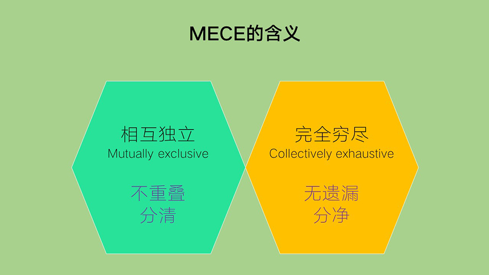

一套解决问题的底层方法 
<!-- truncate -->

:::note解决问题的底层逻辑

-   第一步: 明确和理解问题
-   第二步: 拆分和定位问题
-   第三步: 提出解决方案
-   第四步: 总结

:::

:::caution注意

解决问题的二八定律

-   80%时间用来拆解和定位问题
-   20%时间寻找解决方案和总结

:::

## 第一步: 明确及理解

>   我遇到的问题的本质是什么 ?

1.   找出最核心的问题点?
2.   明确希望达成的目标?
3.   明确解决问题可利用的资源?

import Tabs from '@theme/Tabs';
import TabItem from '@theme/TabItem';

<Tabs values={[
	{label: '例子一', value: 'example_1'},
	{label: '例子二', value: 'example_2'},
	]}>
	<TabItem value="example_1" label="例子一" default>
		

			
举例说明--妈妈让你穿秋裤事件

				<pre>
					- 问题核心: 妈妈怕你着凉, 所以想通过穿秋裤让你保暖 
					- 达成目标: 保暖 
					- 可利用资源: 爸爸, 用来盖腿的外套 
				</pre>                 
		

​	</TabItem>
	<TabItem value="example_2" label="例子二" default>
		

			
举例说明--帮老板解决人员流失问题

				<pre>
					- 问题核心: 人员流失率高达50% 
					- 达成目标: 将该比例降到30% 
					&emsp;&emsp;&emsp;&emsp;- 高级说法: 通过行业横向数据对比, 人员流失一般在30%左右为正常范围, 咱们的确实有些高, 您看咋们公司降到30%怎么样??? 
					- 可利用资源: 爸爸, 用来盖腿的外套 
					- 可利用资源: 整个公司的就业, 离职等个人员资料
				</pre>                 
		

​	</TabItem>
</Tabs>

******

## 第二步: 定位和拆解

### 1. 定位元问题的意义

:::note名词解释  

-   复杂问题: 多个维度和多个变量的集合问题
-   元问题: 最本质, 最细小的待解决问题

:::

> 业务中, 老板的工作就是 **拆分业务目标 ** --> **KPI**
>
> 对应方法论中就是, **拆分** 复杂问题 --> **元问题**
>
> 所以 **KPI** 就是 **元问题**
>
> 通过不断解决一个个 **元问题**, **复杂问题** 就消失了, 业绩也就达标了

### 2. 如何拆解到元问题

#### 拆分一 - 公式化思维

> 如何可以 **准确的** 定位到 **元问题**
>
> 我们可以利用 **公式化思维**

	
举例说明--提高广告收入

		<pre>
			- 达成目标: 提高广告收入 
			- 公式思维拆解后: 广告收入=展现量×点击率×每个点击的价格 
			&emsp;&emsp;&emsp;&emsp;- 通过拆解后, 一个复杂问题被分解成了元问题, 解决公式任何变量均可以提升总收入
		</pre>                 

##### 如何公式化

	
举例说明--估算北京地铁运客量&emsp;

		<pre>
- 首先对于运客量可以从 <u>供和需</u> 两个方面思考该问题(选择需求角度较为简单)  
- 需求角度的计算公式大概为 
&emsp;&emsp;&emsp;&emsp;- <u>每日运客量 = 每日地铁数 × 每条地铁装载人数</u> 
&emsp;&emsp;&emsp;&emsp;- <u>每日地铁数 = 地铁线数 × 每条线同时运行的地铁数 × 地铁每天运行次数</u> 
&emsp;&emsp;&emsp;&emsp;- <u>每条地铁装载人数 = 每辆地铁的车厢数 × 每节车厢的核定人数 × 上座率</u> 
&emsp;&emsp;&emsp;&emsp;- (北京地铁的上座率大约会超过 200%)  
- 需求角度的计算公式汇总后为  
&emsp;&emsp;&emsp;&emsp;- <u>每日运客量 = 地铁线数 × 每条线同时运行的地铁数 × 地铁每天运行次数  
&emsp;&emsp;&emsp;&emsp;&emsp;&emsp;× 每条地铁装载的人数 x 每辆地铁的车厢数 × 每节车厢的核定人数 × 上座率</u>  
		</pre>                 

**结果如何不重要, 重要的是拆分问题的思路, 这种公式化的逻辑**

******

#### 拆分二 - 假设驱动

:::note假设驱动解释

应对复杂问题, 寻找解决方案之前, 先来做一个尽可能合理的假设

假设问题可能出现在某个细分的问题点上

:::

**好处:**
1. 解决问题过程中树立明确的目标

	- 这个目标在被证实或证伪的情况下, 参考他, 并不断修正 **假设**
	- 再求证, 再修改, 不断 **逼近** 真实结果
2. 省时省力

	- 可以让我们延一条路线进行
	- 集中时间和精力去解决最可能解决问题的事情

******

#### 拆分三 - 构建问题树

> 别称 - 思维导图

**好处:**
1. 更容易找到问题所在
2. 问题都变成任务，清晰、没有遗漏地分配给其他人

**搭建的步骤:**
1. 找到 **核心问题** 和 **起始问题**
2. 前因 - 确定 **导致** 上述问题的 **主要原因**
3. 后果 - 确定上述问题的 **主要后果**
4. 根据以上因果关系画图
5. 反复审查, 看是否有缺东西

******

### 3. 问题如何拆解到底

> 1. 先利用MECE原则拆分问题
>
> 2. 再通过数据对比分析

#### 阶段一: MECE拆解

:::note"MECE法则"-麦肯锡
- 完全穷尽、相互独立
- `Mutually Exclusive Collectively Exhaustive`
:::

**MECE法则含义:**

:::noteMECE分类-类型(两种)

> 前提:
> 1. 熟识你所在领域的业务和常识
> 2. 要经常提问和学习, 获得更多信息, 形成自己的一套逻辑

******

- 并列结构
	- 无关联型
- **数理结构**
	- 可以公式化的分类方式
	- 保证科学分类的最理想方式
:::

	
饮料厂案例--MECE问题树解决问题&emsp;

		<pre>
- 饮料公司利润下降了30% (假设因人力成本提升造成的利润下降)  
- 通过MECE的 <u>数理结构</u> 的分类方式, 列出问题点 
&emsp;&emsp;&emsp;&emsp;- <u>利润 = 收入 - 成本</u> 
&emsp;&emsp;&emsp;&emsp;- <u>成本 = 人力成本 + 仓储物流成本 + 原材料成本</u> 
&emsp;&emsp;&emsp;&emsp;- <u>收入 = 碳酸饮料收入 + 无糖饮料收入 + 茶饮料收入 + 矿泉水收入</u>  
- 通过假定驱动去验证数据, 发现假设是错的, 及时调整方向(调整后认为销量下降会造成利润下降)  
- 通过不断求证假设的过程, 可得出一个较为合理, 满意的结果
		</pre>                 

#### 阶段二: 对比分析

- 横纵对比看数据
	- 横向对比: 同级同类对比分析
		- 例如: 本司碳酸饮料今年销售额下降, 但通过横向对比其他公司, 这是普遍现象, 那就不去想怎么提高碳酸的销售额, 应该考虑更有前景的产品上
	- 纵向对比: 某个时刻的数据去和历史上所有的数据做比较，去看这个大的趋势是怎么样
- 掩盖问题的平均数
	- 平均数这个概念下容易掩盖特别多的可能性，而且会带来很多的误导性
		- 例如: 游戏公司收集用户在**游戏卡时的跳出率**
			- 通过平均值计算, 2000个用户无论多低延迟**基本不跳出**
			- 如果细分的话, 其中1900个是**免费用户**, 基本不跳出
			- 剩下100个付费用户, 延迟**0.5秒**的时候就已经有**85%的付费用户都跳出**了, 他的跳出率在**整体数值中占比太低**, 无法体现
			- 经分析, 我们知道: 想提高收益, 就要尽量降低延迟, 才能留住金主

******

## 最后两步: 解决方案和总结

### 1. 解决方案

> 通过MECE的的运用, 基本可以确定比较MECE的解决方案了
>
> 如何检验解决方案, 这里有一个隐喻的说法: "饼干厂方法"
> > 形容低门槛生意
> > 
> > 一个解决方案如果通过层层拆解和定位, 最终适合任何一家公司, 那就很可能不是一个特别好的方案

### 2. 汇报和总结

> 如何突出表现自己的能力, 如何说服别人
>
> > **别人是否觉得是对的，要比你自己是否觉得是对的要更重要一点**
>
> > > 推荐书籍 "金字塔原理"

1. 不断地分拆, 直到哪个不可辩驳的事实
2. 每一层要控制要点数目, 要突出重点
	- 结论先行!
	- 结论先行!
	- 结论先行!

******

## 人生的问题

### 1. 明确问题

	寻找自己, 寻找人生的意义和目标

### 2. 拆解定位 - IPO模型

> 将人生公式化后得出 IPO模型
>
> `input-输入 process-处理 output-输出`
> 
> 问题 **IPO模型** + **目标**, 通过输出与目标做对比, 反馈到你的输入, 不断修正

- 几种课程推荐的解决方案
	- 不断问自己为什么? 寻找自己最本质的动力
	- 列清单, 排序优先级
	- 假设无条件获得的极端情况, 你会如何选择?
	- 不断了解自己, 不断试错.

## 收获来源

内容来源于 [得到APP课程: 怎样成为解决问题的高手](https://www.dedao.cn/course/detail?id=m0GbPnO9NwlJ9p1sbAV7p6kr5LQxRd)
